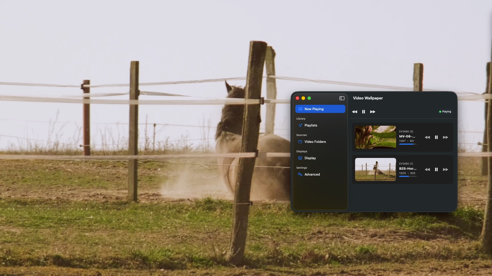
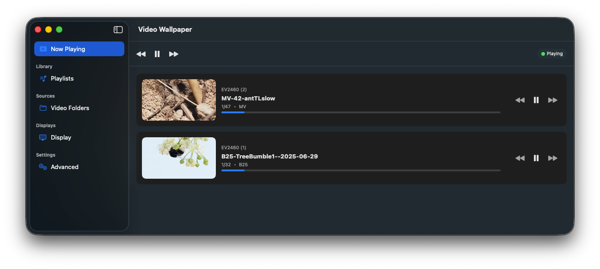
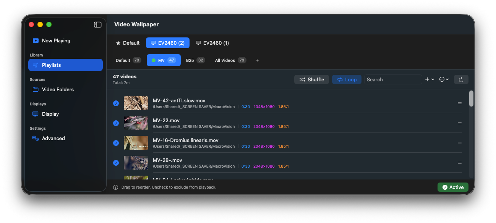
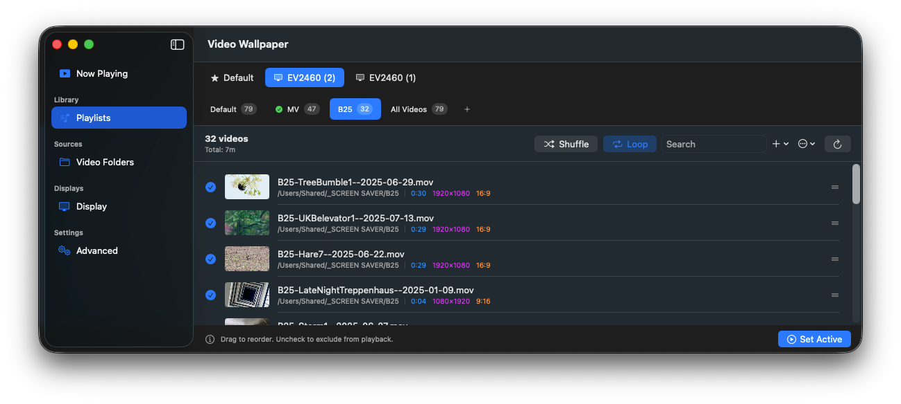
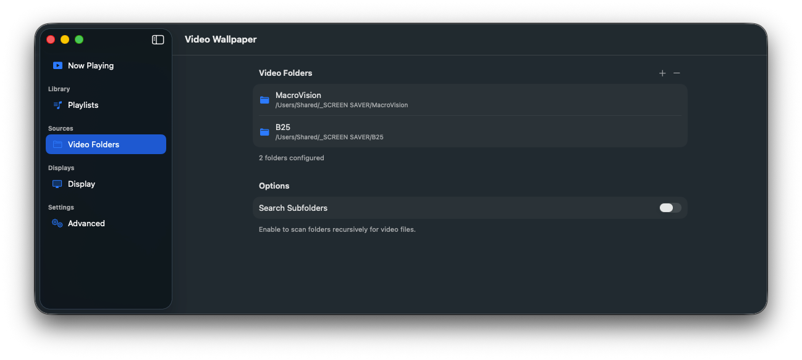
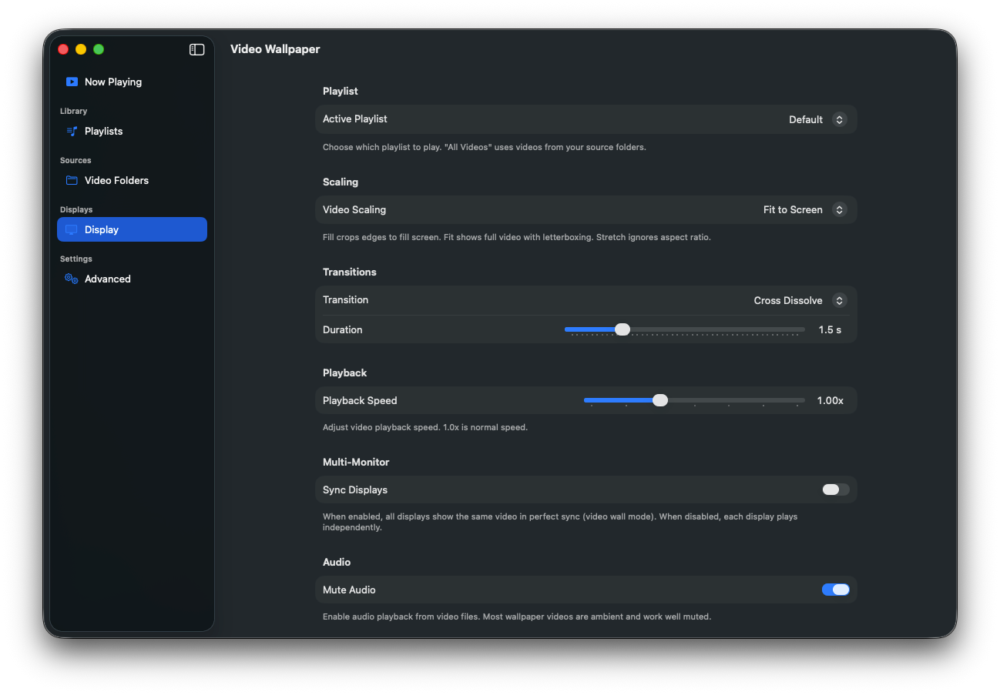
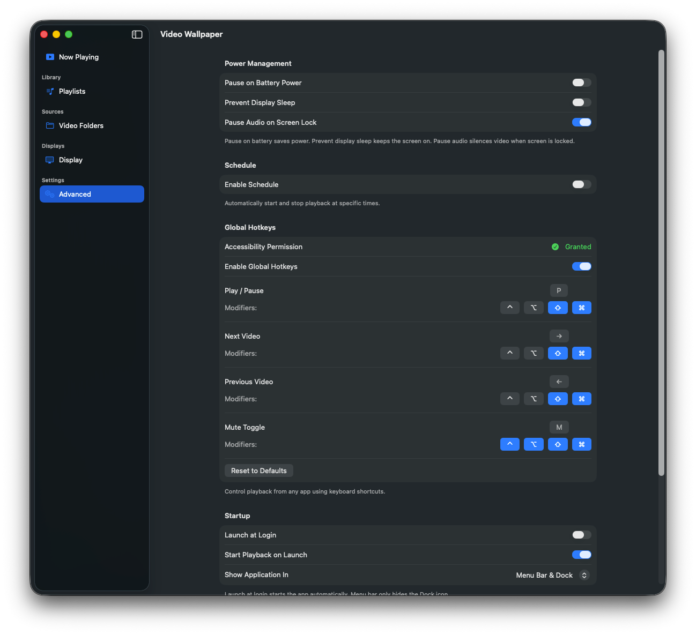
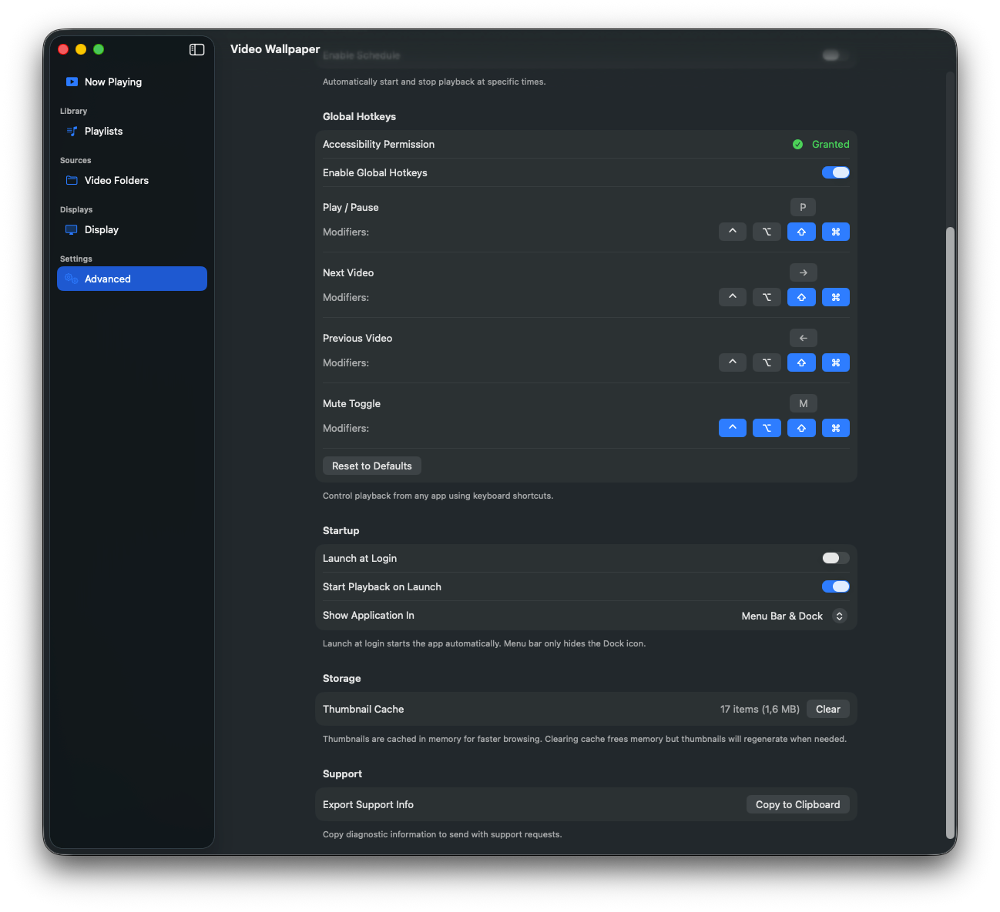
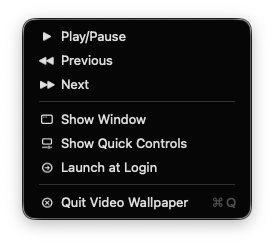

# Video Wallpaper

A macOS menu bar app that displays videos as animated desktop wallpaper.


[](https://github.com/Xpycode/VideoWallpaper/releases/download/v1.0/VideoWallpaper-v1.0.dmg)




## Features

- **Video Wallpaper** — Play any video as your desktop background
- **Multi-Monitor Support** — Independent playlists per display, or sync all screens
- **Playlist Management** — Create playlists, shuffle, loop, and organize your videos
- **Menu Bar Controls** — Quick access to playback controls from the menu bar
- **Smooth Transitions** — Crossfade between videos for seamless playback
- **Power Aware** — Automatically pause on battery power to save energy
- **Launch at Login** — Start automatically when you log in

## Screenshots

### Now Playing


### Playlists



### Video Folders


### Display Settings


### Advanced Settings



### Menu Bar


 

## Installation

### Download

1. Download the latest release from the [Releases](https://github.com/Xpycode/VideoWallpaper/releases) page
2. Open the DMG and drag **Video Wallpaper** to your Applications folder
3. Launch from Applications or Spotlight

### Requirements

- macOS 13.0 (Ventura) or later
- Apple Silicon or Intel Mac

## Usage

1. **Add Video Folders** — Go to Video Folders and add folders containing your videos
2. **Create Playlists** — Organize videos into playlists in the Playlists tab
3. **Play** — Click Play in the menu bar or main window

### Keyboard Shortcuts

| Shortcut | Action |
|----------|--------|
| `Space` | Play/Pause |
| `⌘ ←` | Previous Video |
| `⌘ →` | Next Video |

### Multi-Monitor

- **Independent Mode** — Each display has its own playlist and playback controls
- **Sync Mode** — All displays show the same video simultaneously (Display → Sync Displays)

## Building from Source

1. Clone the repository:
   ```bash
   git clone https://github.com/Xpycode/VideoWallpaper.git
   ```

2. Open `01_Project/VideoWallpaper.xcodeproj` in Xcode

3. Build and run (⌘R)

### Requirements

- Xcode 15.0+
- macOS 13.0+ SDK

## Automatic Updates

Video Wallpaper includes automatic updates via [Sparkle](https://sparkle-project.org/). You'll be notified when new versions are available.

## License

This project is licensed under the MIT License — see the [LICENSE](LICENSE) file for details.

## Acknowledgments

- [Sparkle](https://sparkle-project.org/) — Software update framework for macOS
- Built with SwiftUI and AVFoundation

---

**Video Wallpaper** is a sister project to [Video Screen Saver](https://github.com/Xpycode/VideoScreenSaver).
